# transformer 🤖🧬🤗
transformer : HuggingFace # Transformer # AWS Sagemaker Studio Lab

## Objective
- Learn what Transformer models can do and use the first tool from the 🤗 Transformers library: the pipeline() function.

# Transformers

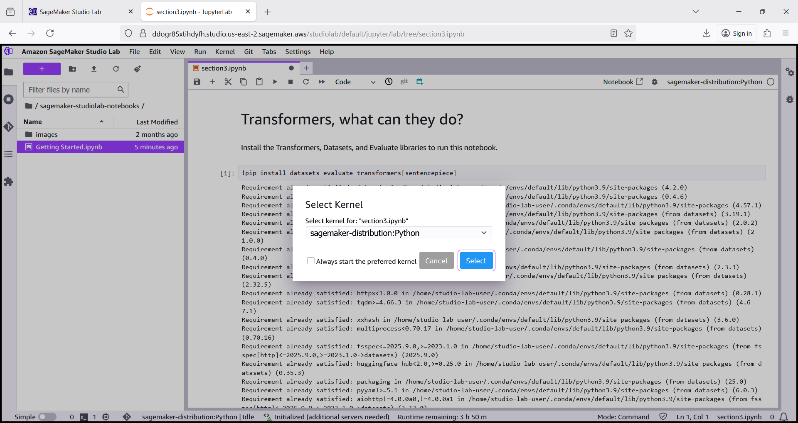

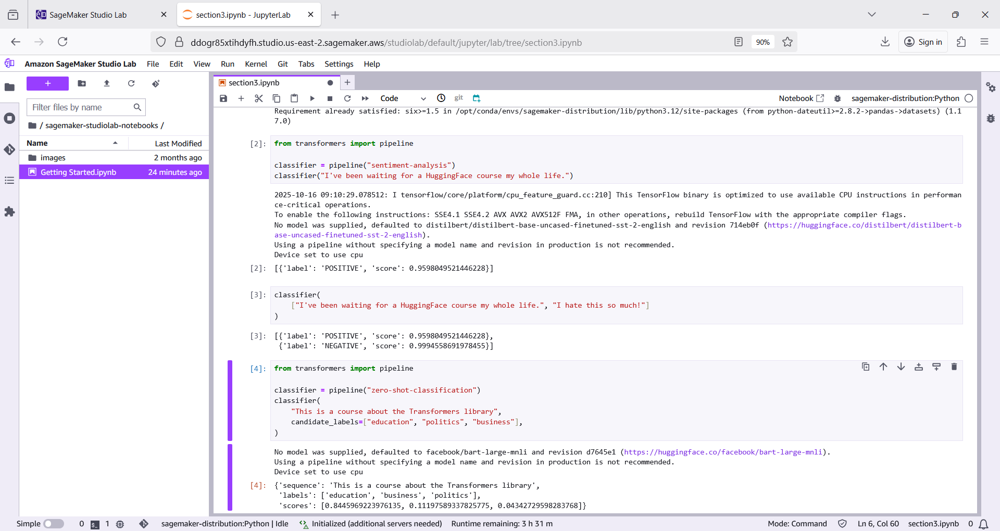

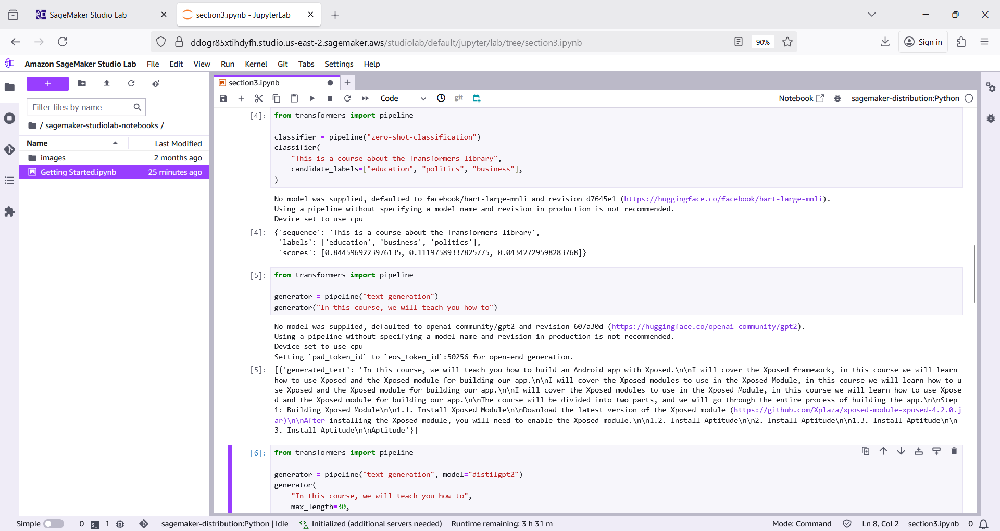

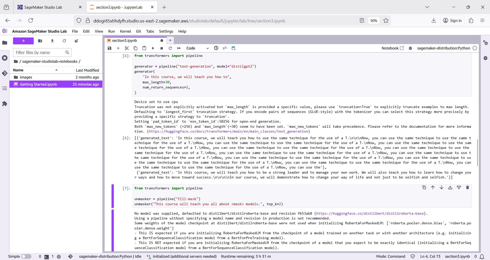

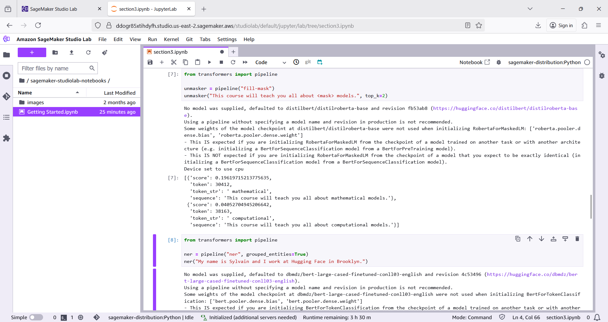

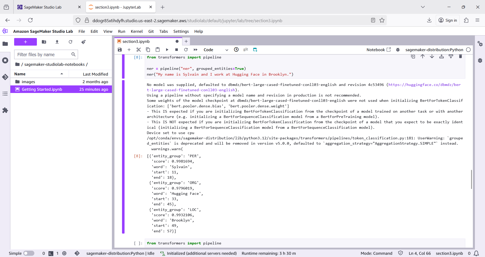

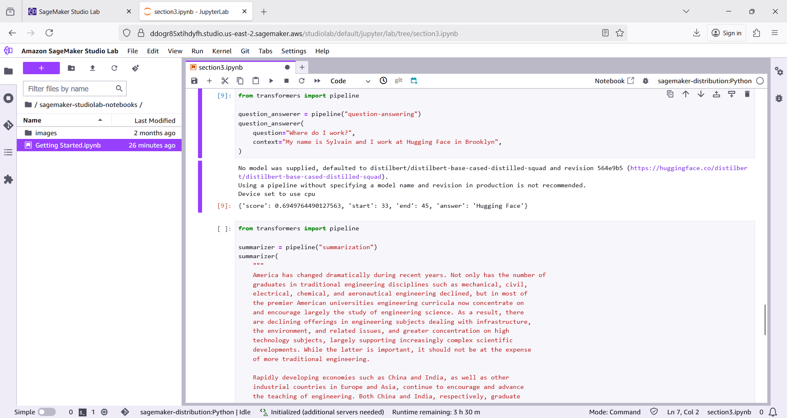

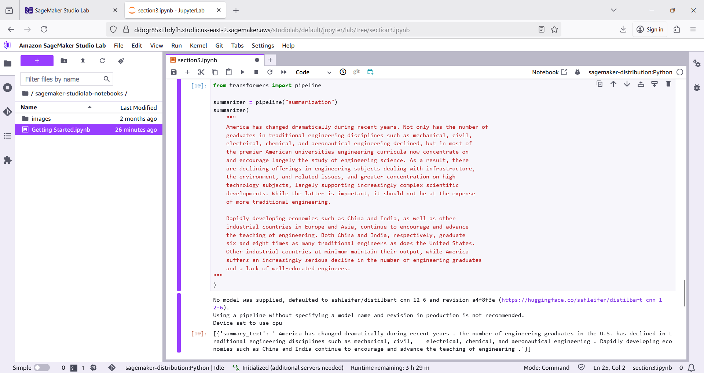

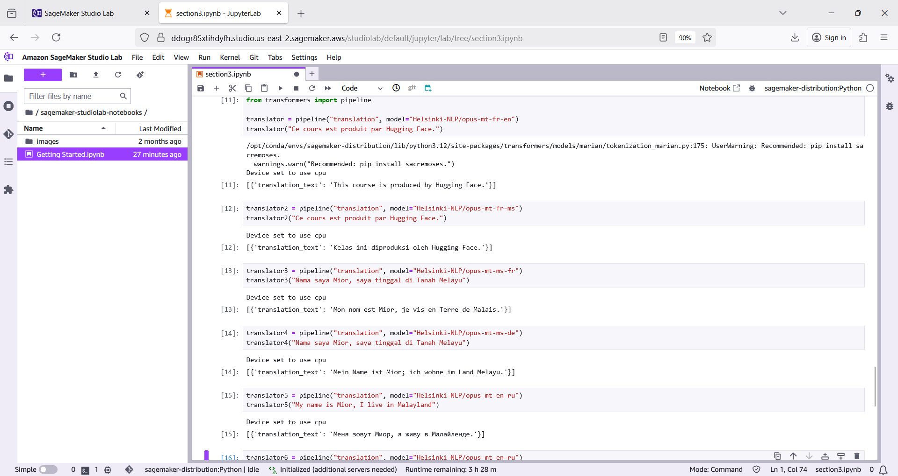

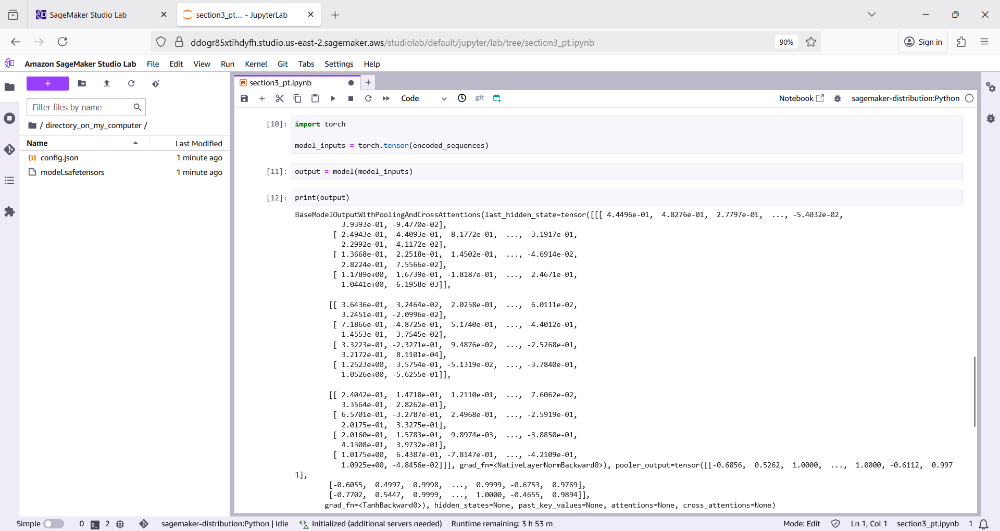

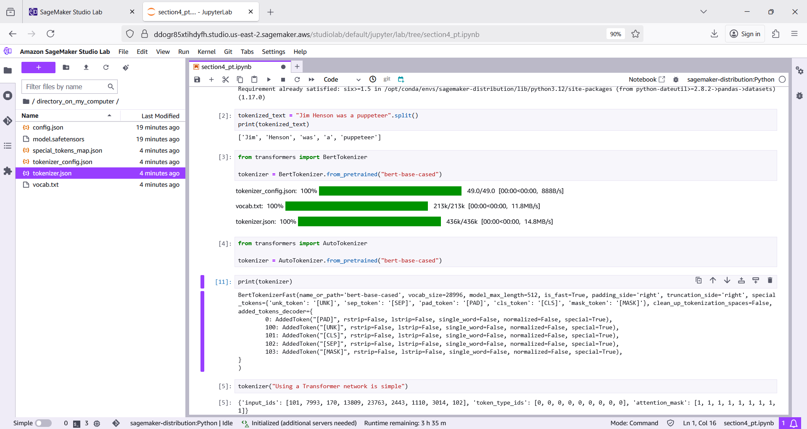

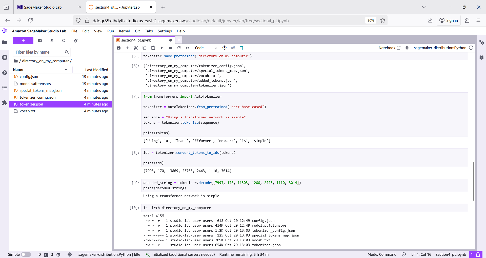

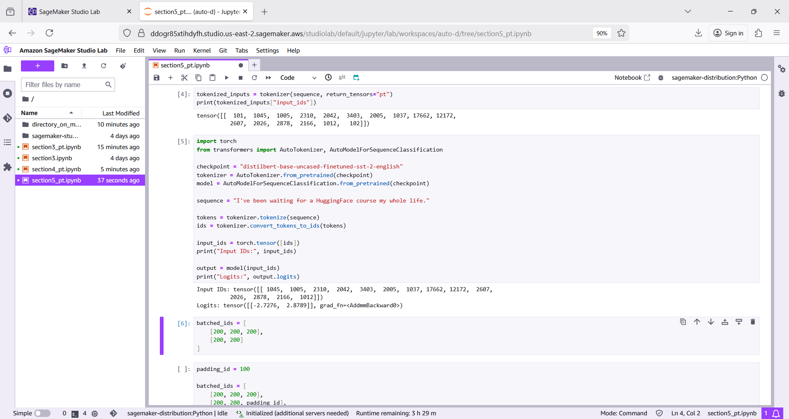

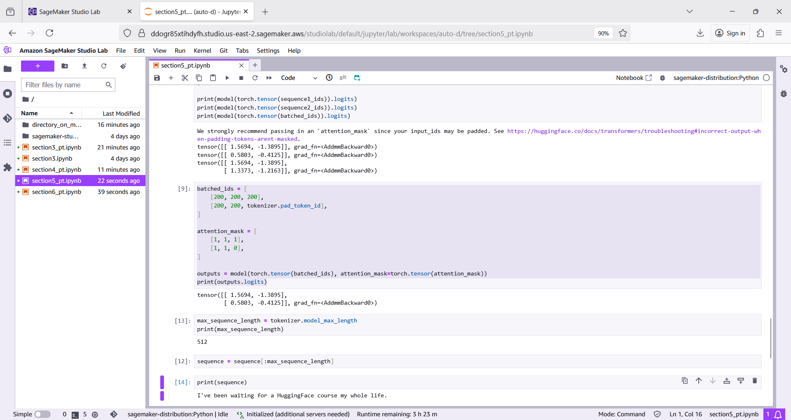

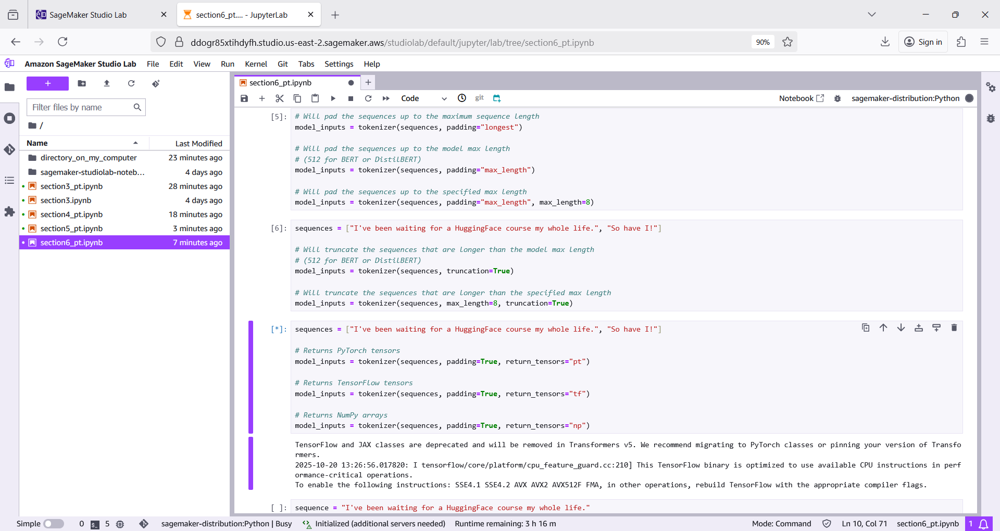

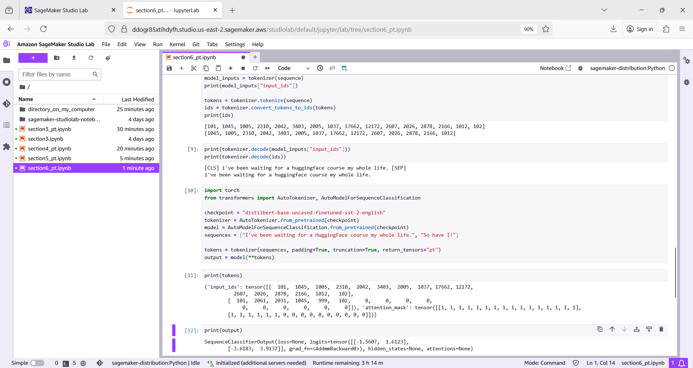

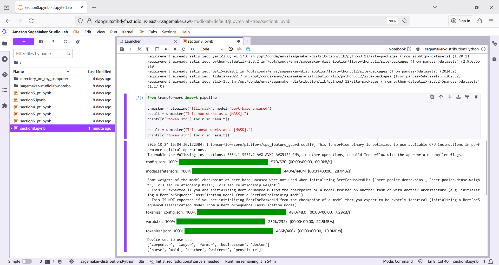

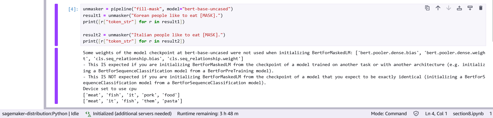

## CI/CD in Progress...

